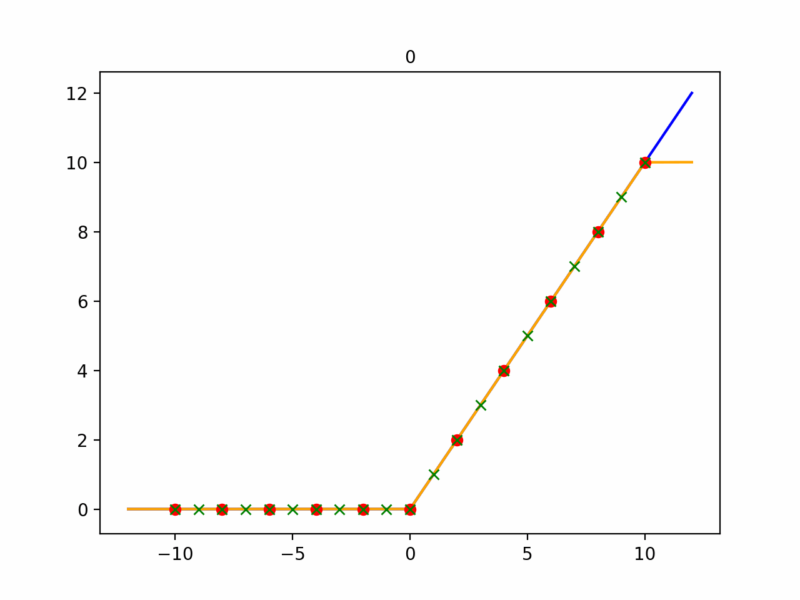
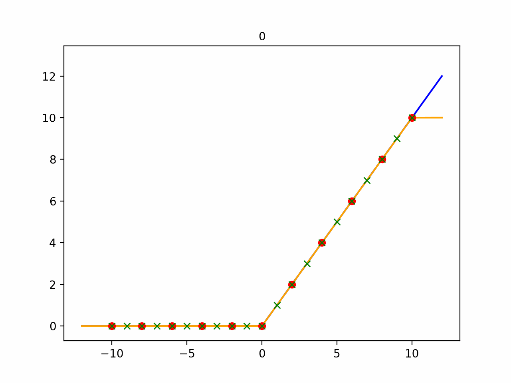
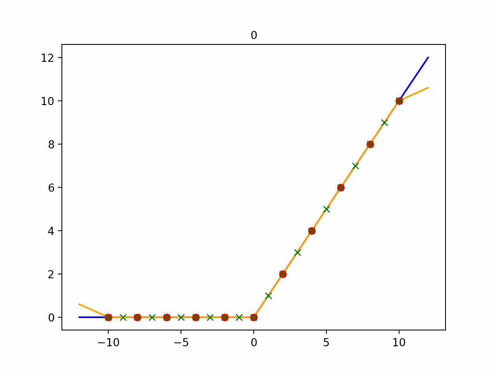
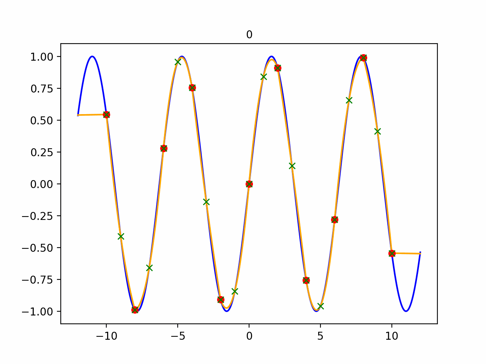
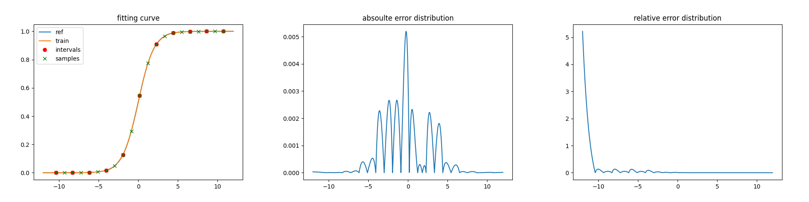
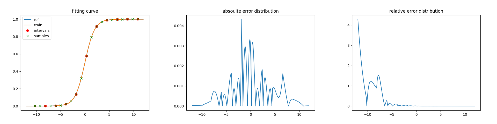
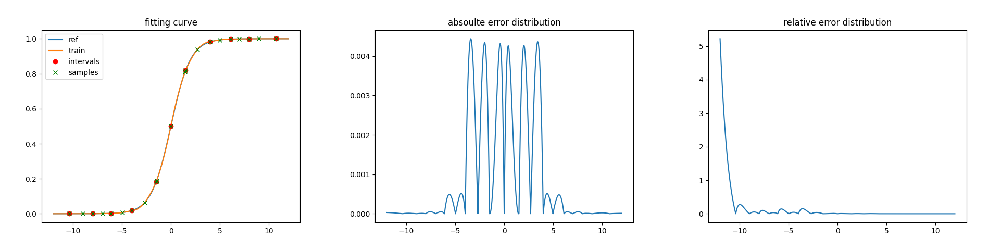
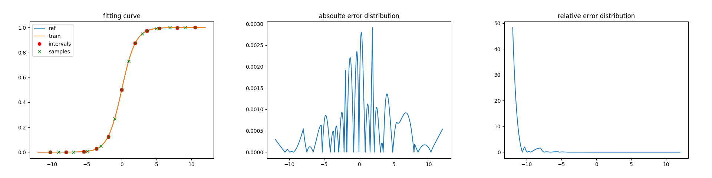
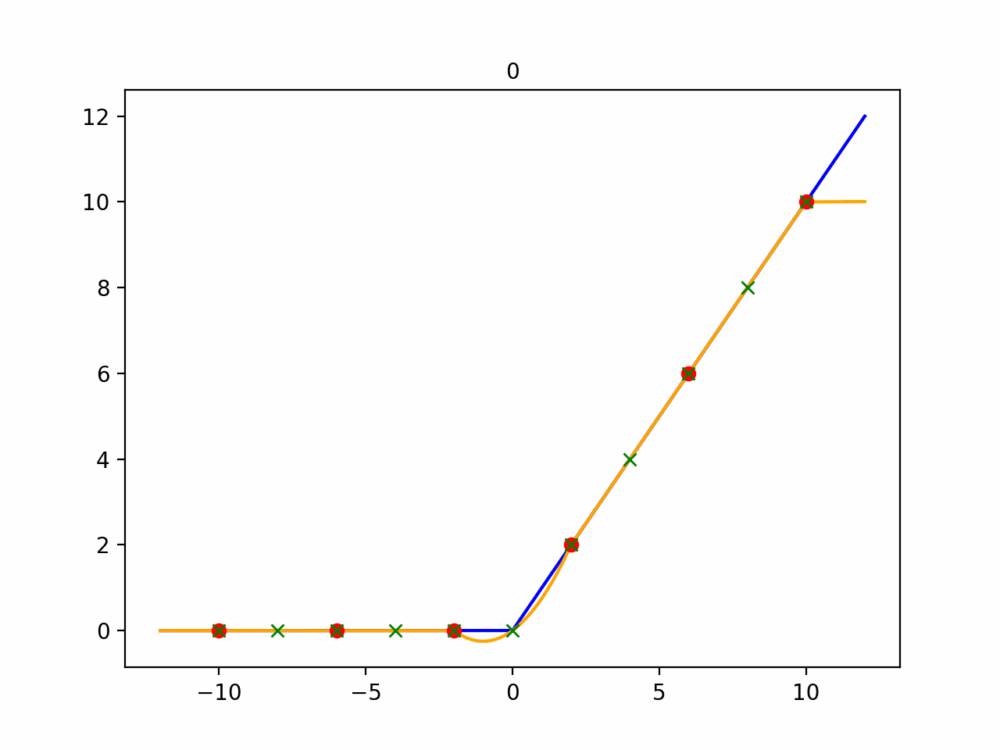

## todo
5. fix AttributeError: module 'scipy.integrate' has no attribute 'simps'. Did you mean: 'simpson'?
6. fix zero division error

[toc]

## motivation

you may theorectically work out the solution for interpolation. however, results may differ and get extremely hard (for me) given different input distributions and criterions. so a simple workaround is using gradient descent to optimize given arbitrary objective function, input distribution, evaluation criterion.

**we can see the powerful fitting ability with gradient descent!**


## method

given objective function (`objective_func`), the number of intervals (`N`) and degree of polynomial (`degree`), we want to interpolate with polynomials within intervals, and interpolate linearly outside the left / right most boundary (`bl`, `br`). so we need to work out the parameters for interpolation points for each interval (`sample_points`) and the slope for outside linear interpolation (`sl`, `sr`).

a tricky way to find nearly optimal parameters is **neural-network-like optimization**. with the problem formulation as below:

$$ min\ loss(y_{ref}, y_{pre}) $$
$$ st. \ y_{ref} = objective\_func(x) $$
$$ y_{pre} = linear_{left}(x) * I_{x\in left} + linear_{right}(x) * I_{x\in right} \sum_i interpolation_i(x) * I_{x\in i} $$
$$ linear_{left}(x) = y_{l} + s_l * (x-b_l) $$
$$ linear_{right}(x) = y_{r} + s_r * (x-b_r) $$
$$ interpolation_i (x)=\sum_j y_j\frac{\prod_{k\ne j}(x-x_k)}{\prod_{k\ne j}(x_j - x_k)} $$

**pipeline** would be like this:

1. generate large amount of data `x` from a specific `distribution`
2. calculate `y_ref` and `y_pre` respectively
3. calculate loss between `y_ref` and `y_pre`
4. update parameters using backpropagation and gradient descent
5. until threshold is met (ie. maximum fitting epochs)

to this end, we have four methods to implement: whether sample points are equally distributed and whether sample values are derive from objective function or learned.

### equidistant

`sample_points` are equally distributed and `intervals` are of the same length. `sample_values`, the corresponding values of `sample_points`, are calculated with the `objective_func`. 

in this setting, we only need to optimize: 1) left / right boundary `bl` / `br` which control the `sample_points` distribution between them. 2) left / right slope `sl` / `sr` for outside linear interpolation.



### equidistant_tuned_values

`sample_points` are equally distributed and `intervals` are of the same length. `sample_values`, however, are **learned with the initial values from** `Sigmoid`. 

in this setting, we only need to optimize: 1) left / right boundary `bl` / `br` which control the `sample_points` distribution between them. 2) `sample_values` for `sample_points`. 3) left / right slope `sl` / `sr` for outside linear interpolation.


### adaptive

`sample_points` are NOT equally distributed and `intervals` are NOT of the same length. `sample_values` are calculated with the `objective_func`. 

in this setting, we only need to optimize: 1) `sample_points` for interval interpolation. 2) left / right slope `sl` / `sr` for outside linear interpolation.

for implementation, `sample_points` would sometimes cross each other, leading to instability of learning. so `sample_points_buffer` is proposed to restrict step size of single point. (ie. `sample_points_buffer[i-1]` <= `sample_points[i]` <= `sample_points_buffer[i+1]`)



### adaptive_tuned_values

`sample_points` are NOT equally distributed and `intervals` are NOT of the same length. `sample_values`, **are learned with the initial values from** `Sigmoid`. 

in this setting, we only need to optimize: 1) `sample_points` for interval interpolation. 2) `sample_values` for `sample_points`. 3) left / right slope `sl` / `sr` for outside linear interpolation.


### note

blue line is the `objective_func`. orange line in the interpolation. red dots stand for `intervals` and green dots stand for `sample_points`. we can **summarize the differences** between these methods:

|method|equidistant|equidistant_tuned_values|adaptive|adaptive_tuned_values|
|:-:|:-:|:-:|:-:|:-:|
|`bl` / `br`|learnable|-|learnable|-|
|`sample_points`|x|learnable|x|learnable|
|`sample_values`|x|learnable|x|learnable|
|`sl` / `sr`|learnable|learnable|learnable|learnable|

we may draw some **simple conclusions** from the above demo
1. `*_tuned_values` models perform poorly if not properly initialized
2. `adaptive*` models can sometimes jitter, tiny distance between `sample_points` cause the ill-posed problem!
3. `adaptive_tuned_values` should be the most powerful model. however, it would be the most challenging to learn if not properly configured. `equidistant` would always deliver stable and relatively good performance, recommended to try first!
4. `*_tuned_values` models are proposed not just to interpolate, but to fit the `objective_func`. but in theory, they are somehow the same with non-`*_tuned_values` models the if given more `sample_points`.


## usage

### 0. setup

install necessary packages by:

```bash
pip install -r requirements.txt
```

### 1. fit a objective function

quick start to launch a fitting by:

```bash
# select models from: equidistance, equidistant_tuned_values, adaptive, adaptive_tuned_values
python main.py --model equidistant --objective_func relu --xmin -12 --xmax 12 --epoch 1000
```

the default configuration is to train with **data generated by normal distribution** and eval during training with **data generated by uniform distribution**. 

results will be saved at 
- logs/exp/
  - tensorboard/ # loss curve during training
  - input_distribution.png # a histogram for input data
  - log.txt # epoch and loss
  - progress.gif # visualization of interpolation
  - model.pth # trainable and non-trainable parameters

full arguments:

```bash
##### model #####
# model selection: --model equidistant
# number of intervals: --N 10
# degree of polynomial: --degree 2
# left boundary of intervals: --bl -10
# right boundary of intervals: --bl 10
# left linear interpolation slope: --sl 0
# right linear interpolation slope: --sr 0
# minimum output: --min_val None
# maximum output: --max_val None
##### fitting #####
# objective function selection: --objective_func relu
# distribution to generate x. N for normal distribution, U for uniform distribution: --dist N
# distribution parameters, (mean, std) for N, (a, b) for U: --dist_param (0,5)
# fitting epochs: --epoch 1000
# batch size: --batch 128
# optimizer to update parameters: --optim adam
# learning rate: --lr 0.001
# loss function: --loss_fn mse
# minimum value of x during evaluation: --xmin -12
# maximum value of x during evaluation: --xmax 12
# step size for uniform distribution sampling: --step 0.001
##### logging #####
# name of the experiment: --exp_name exp
# logging directory: --logging_root ./logs
```

1.1 **you can freeze**

you can add `interpolation.set_freeze(["bl", "br"])` to the code just to fit `sl` and `sr`. try something else by freezing parameters.

```bash
python main.py --model equidistant --objective_func relu --xmin -12 --xmax 12 --sl -0.3 --sr 0.3
```




1.2 **how to add arbitrary objective functions**

check out examples in `src/activations/activation_factory.py`. just define a function to return a Callable and decorate with `@objective_function.register("some_name")`.

try fitting a sine function:

```python
@objective_function.register("sine")
def sin(*args, **kwargs):
    return torch.sin
```

```bash
python main.py --model equidistant --objective_func sine --xmin -12 --xmax 12 
```



you can further define criterions, optimizers... in the `main.py`.

### 2. test fitting results

test the fitting performance **after the above training**. running the following command will load trained interpolation model to eval:

```bash
python fitting_test.py --model equidistant --objective_func relu --xmin -12 --xmax 12
```

results will be saved at
- test/exp/fitting
  - abs_error.png # absolute error distribution
  - fitting.png # final interpolation result
  - relative_error.png # relative error distribution
  - metric.txt # metrics and trained parameters

metrics includes:
- abs_error_acc: absolute error accumulation
- abs_error_avg: absolute error average
- max_abs_error: maximum absolute error, (x, y, y_ref, abs_error)
- relative_error_acc: relative error accumulation
- relative_error_avg: relative error average
- max_relative_error: maximum relative error, (x, y, y_ref, relative_error)
- model_time: time used by interpolation
- ref_time: time used by objective function

we do a simple test on these four models (1000 epochs to fit). `Sigmoid` as `objective_func` would be fair.

|method|equidistant|equidistant_tuned_values|adaptive|adaptive_tuned_values|
|:-:|:-:|:-:|:-:|:-:|
|abs_error_acc|0.01441|0.01606|0.02225|**0.01307**|
|abs_error_avg|0.00060|0.00067|0.00093|**0.00054**|
|max_abs_error|0.00520|0.00432|0.00444|**0.00291**|
|relative_error_acc|**3.46086**|7.35128|3.63681|24.72856|
|relative_error_avg|**0.14420**|0.30630|0.15153|1.030357|
|max_relative_error|5.21991|**4.29128**|5.22027|48.33312|
|model_time|0.00735|0.00625|0.00656|0.00687|

note: **relative error would be large**, since `Sigmoid` is close to zero for negative input.


equidistant:



equidistant_tuned_values:



adaptive:



adaptive_tuned_values:




### 3. paired with neural networks

to integrate with existing neural networks, simply replacing the original activation functions. refer to the example in `nn_test.py`. run a baseline to perform cifar10 classification with the following command:

```bash
python nn_test.py --activation equidistant --freeze
```

**you can load the parameters and write a static function which is a lot faster**.

## troubleshooting

### ill-posed problem

when is bumping, try reducing N, since there might be 
nearly ill-posed

```bash
python main.py --model adaptive --objective_func relu --xmin -12 --xmax 12 --epoch 1000
```


simply reduce N to 5 (default is 10) would do the trick

```bash
python main.py --model adaptive --objective_func relu --xmin -12 --xmax 12 --epoch 1000 --N 5
```



or using equidistant method

```bash
python main.py --model equidistant --objective_func relu --xmin -12 --xmax 12 --epoch 1000
```


### training with cuda

it would be nice to check out the optimal activation function for each layer in the model for different tasks.

but training with cuda is currently not supported. errors occur... maybe ok now?!

need to specify device when instantiate, model.to(device) will not load interpolation!

### loading interpolation to cuda

device management can be improved...

if integrated with common neural networks, they will not automatically load interpolation on cuda. need to do it manually!

### gif generation may take a long time

indeed sir.

### torch.linspace has no gradients

calculate like this

```python
yp = torch.cat((yp, self.interpolate(input, torch.tensor([self.bl + d * (j + i * self.degree) for j in range(self.degree + 1)], device=self.device), self.sample_values[i * self.degree: (i + 1) * self.degree + 1])), -1)
```

## directories
- assets/
- src/
  - activations/
  - interpolation/
  - registry.py
  - seed.py
- main.py
- fitting_test.py
- nn_test.py
- requirements.txt

## reference
- Piecewice Linear Activation function
  - GitHub: https://github.com/MrGoriay/pwlu-pytorch
- torchpwl
  - GitHub: https://github.com/PiotrDabkowski/torchpwl
